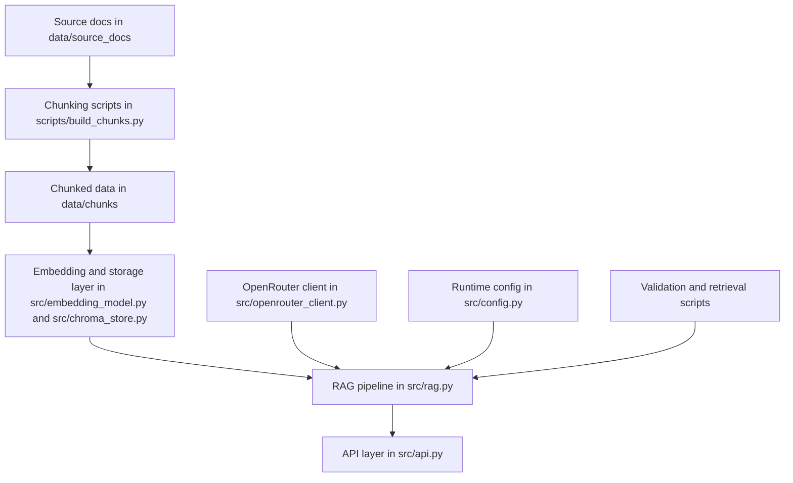

# rag-backend

Python backend for a SkinX RAG workflow. The repository contains scripts, source modules, and documentation for ingesting source documents, building chunks, storing embeddings, and serving retrieval-backed answers.

## Repository tree

```text
rag-backend/
├── README.md
├── AGENTS.md
├── requirements.txt
├── data/
│   ├── system_prompt.md
│   ├── chunks/
│   │   └── skinx_chunks.json
│   └── source_docs/
│       └── SkinXRag.docx
├── docs/
│   ├── SkinX_RAG_ChromaDB_Migration_Guide.md
│   └── projects/
│       └── fix-comparison-branch.md
├── scripts/
│   ├── build_chunks.py
│   ├── ingest_chroma.py
│   ├── test_ask.py
│   ├── test_retrieval.py
│   └── validate_chunks.py
└── src/
    ├── __init__.py
    ├── api.py
    ├── chroma_store.py
    ├── config.py
    ├── embedding_model.py
    ├── openrouter_client.py
    └── rag.py
```

## Architecture view



## What this repo contains

- `src/` - core application modules
- `scripts/` - one-off utilities and validation scripts
- `data/` - source documents, prompts, and chunked data
- `docs/` - design notes and migration documentation

## Project goal

This codebase supports a retrieval-augmented generation pipeline for SkinX content. The current work also includes cleaning up the Git history and getting the `development` branch ready for a normal pull request into `main`.

## Current focus

- fix the comparison branch history so GitHub can open a normal PR
- keep commits grouped clearly by file or task
- document the repo structure and workflow

## Suggested workflow

1. Make changes on `development`.
2. Keep commits small and descriptive.
3. Open a pull request into `main` when the branch compares cleanly.
4. Use `docs/` for longer notes and `scripts/` for repeatable utilities.

## Notes

If you are looking for implementation details or migration context, see `docs/SkinX_RAG_ChromaDB_Migration_Guide.md`.
